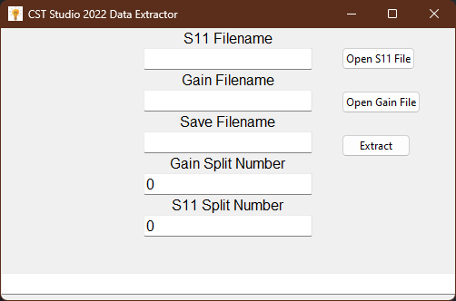
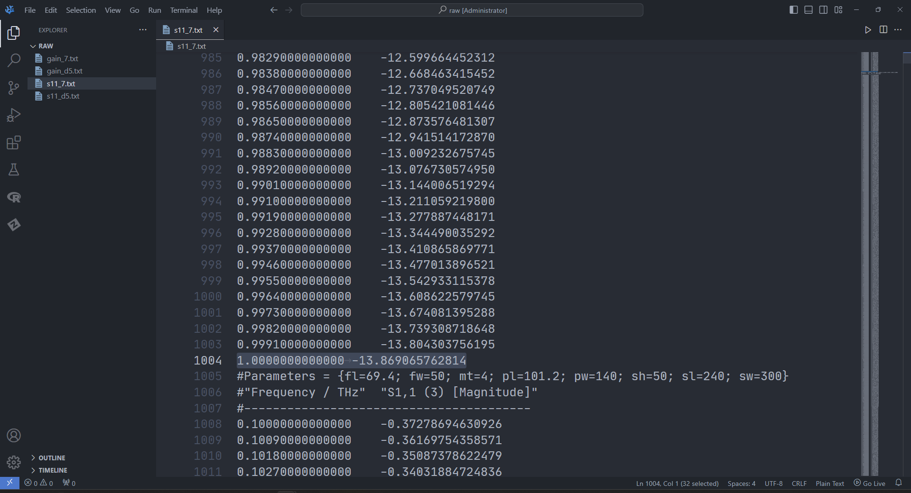
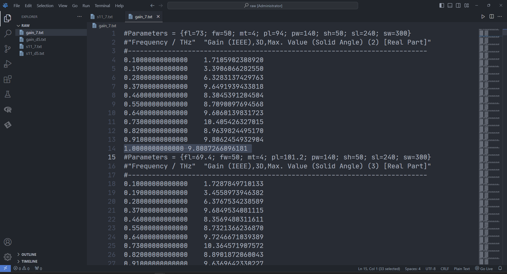

# CST-Studio-Extractor


Extract exported ASCII data to csv file for a **greater** purpose. Works only for CST Studio 2022. 

## Installing

Clone this repository using

```bash
git clone https://github.com/pathak373/cst-studio-extractor
cd cst-studio-extractor
pip install -r requirements.txt
```

## Usage

The results from the cst project must be exported in ASCII format, which can be kept anywhere.

Run the script using
```bash
python main.py

```
You will be greeted with a GUI application



Open the S11 and Gain file which was extracted earlier. Give a filename such as `./exported.csv`; this will save the resultant file in the current directory of the program. Alternatively, you can give a absolute path to some other directory where you may want to save the file.

S11 and Gain Split number refers to the line number at which the `first reading` of s11 / gain ascii file ends.




For example, the `S11 Split Number` and `Gain Split Number`would be `1004` and `14` respectively.